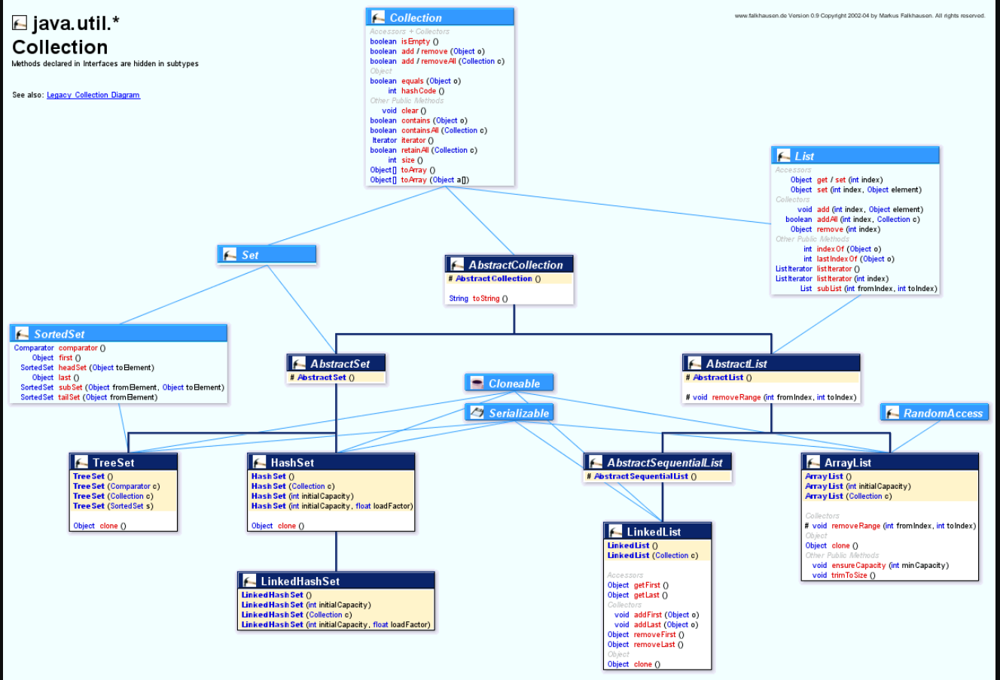
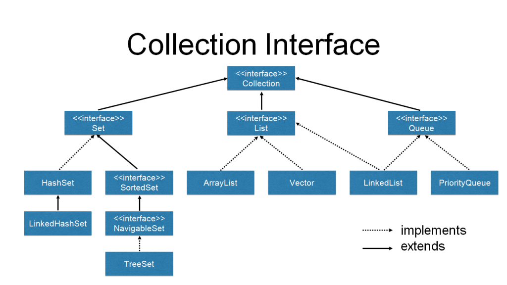

# Collections

> 컬렉션즈 프레임워크
> collections의 인터페이스에 대해서는 다음과 같이 볼 수 있다.
> Link : [Collection 구조][https://prashantgaurav1.files.wordpress.com/2013/12/java-util-collection.gif]







## List와 Set의 차이점

→ List는 중복을 허용하고 Set은 중복을 허용하지 않는다.

List:
 입력한 모든 값들이 저장이 된다.
  순서대로 저장이 되어 순서대로 꺼낼수 있다

Set: 
 입력한 값에서 고유의값만 저장이 된다.
 순서가 보장되지 않는다

## ArrayList

```java
public class Main {
    public static void main(String[] args) {
        ArrayList<Integer> numSet1 = new ArrayList<>();
        numSet1.add(1);
        numSet1.add(2);
        numSet1.add(2);
        numSet1.add(2);
        numSet1.add(3);
        numSet1.add(3);

        Iterator num1 = (Iterator) numSet1.iterator();
        while (num1.hasNext()) {
            System.out.println(num1. next());
        }
    }
}
//결과는 1,2,2,2,3,3
```

ArrayList를 사용하면 다음과 같이 모두 추가가 된다.


## Set
```java
public class Main {
    public static void main(String[] args) {
        HashSet<Integer> numSet1 = new HashSet<>();
        numSet1.add(1);
        numSet1.add(2);
        numSet1.add(2);
        numSet1.add(2);
        numSet1.add(3);
        numSet1.add(3);

        Iterator num1 = (Iterator) numSet1.iterator();
        while (num1.hasNext()) {
            System.out.println(num1. next());
        }
    }
}
//결과는 1,2,3 으로 출력이 된다
```

같은 수를 반복해서 추가해도 한번밖에 들어가지 않는다.


-집합’이라는 뜻을 갖는다

:수학에서 집합은 교집합, 차집합, 합집합과 같은 연산을 할 수 있었는데, Set역시 마찬가지이다

HashSet코드를 통해 확인할 수 있다

```java
public class Main {
    public static void main(String[] args) {
        HashSet<Integer> numSet1 = new HashSet<Integer>();
        numSet1.add(1);
        numSet1.add(2);
        numSet1.add(3);

        HashSet<Integer> numSet2 = new HashSet<Integer>();
        numSet2.add(3);
        numSet2.add(4);
        numSet2.add(5);

        HashSet<Integer> numSet3 = new HashSet<Integer>();
        numSet3.add(1);
        numSet3.add(2);

        System.out.println(numSet1.containsAll(numSet2)); //false
        //1의 집합에 2의 원소 전체가 포함이 되는지 여부를 확인
        System.out.println(numSet1.containsAll(numSet3)); //true
        //3은 1의 부분집합이다, 2는 1의 부분집합이 아니다

        //numSet1.addAll(numSet2);
        //1과 2를 합쳐서 1로 만든다 -> 합집합
        //numSet1.retainAll(numSet2);
        //1과 2의있는 동일한 원소를 1에 담겠다 ->교집합
        numSet1.removeAll(numSet3);
        //1에서 2원소를 뺀 나머지를 1에 담겠다 -> 차집합
    }
}
```


## Iterator

iteraton : 반복의 의미를 갖는다

→컨테이너에 담긴 값들을 하나씩 꺼내서 처리할 수 있는 역할을 한다.

```java
public class Main {
    public static void main(String[] args) {
        HashSet<Integer> numSet1 = new HashSet<Integer>();
        numSet1.add(1);
        numSet1.add(2);
        numSet1.add(3);

        Iterator num1 = (Iterator) numSet1.iterator();
			//Iterator라는 데이터 타입을 가진 인스턴스를 반환
			//hasNext() : 값의 존재여부를 boolean으로 반환
			//next() : 담겨있는 값을 가져옴
        while (num1.hasNext()) {
            System.out.println(num1.next());
        }
    }
}
```

*Collection의 인터페이스에서 정의되어있어서 ArrayList 역시 같은 방법을 사용할 수 있다. 또한 다음과 같이 사용할 수도 있다

```java
Collections<Integer> numSet1 = new HashSet<Integer>;
```


## Map

key : value 로 정의한다

→key값은 중복이 불가능 하다.

→key와 value값을 꺼내는 방법은 두가지가 있다

```java
public class Main {
    public static void main(String[] args) {
        HashMap<String,Integer> numSet1 = new HashMap<String,Integer>();
        numSet1.put("one",1);
        numSet1.put("two",2);
        numSet1.put("three",3);
        System.out.println(numSet1.get("one"));
        //get(key)을 하면 value값을 얻을 수 있다

        iteratorUsingForEach(numSet1);
        iteratorUsingIterator(numSet1);
    }

    static void iteratorUsingForEach(HashMap map) {
        Set<Map.Entry<String,Integer>> entries = map.entrySet();
        //entrySet : map의 값을 담은 Set 데이터 타입의 컨테이너가 만들어진다.
        //Map.Entry라는 인터페이스에는 getKey와 getValue가 정의되어 있다

        for (Map.Entry<String,Integer> entry : entries) {
            //entries에 담긴 값들을 하나씩 꺼내서 출력한다
            System.out.println(entry.getKey() + " : " + entry.getValue());
        }
    }

    static void iteratorUsingIterator(HashMap map) {
        Set<Map.Entry<String,Integer>> entries = map.entrySet();
        Iterator<Map.Entry<String, Integer>> A= entries.iterator();

        while (A.hasNext()) {
            Map.Entry<String,Integer> entry = A.next();
            System.out.println(entry.getKey() + " : " +entry.getValue());
        }
    }
}
```


## 정렬(sort)

Collections.sort에 대해 코드로 간단히 설명하면 다음과 같다

```java
class Computer implements Comparable{
    int serial;
    String owner;
    Computer(int serial, String owner){
        this.serial = serial;
        this.owner = owner;
    }
    public int compareTo(Object o) {
        //object를 인자로 받아서 int를 반환한다
        return this.serial - ((Computer)o).serial;
        // a.compareTo(b)
        // + 현재의 객체가 클때 (a > b)
        // 0 값이 같을때 (a == b)
        // - 현재의 객체가 작을때 (a < b)
    }
    public String toString(){
        return serial+" "+owner;
    }
}

public class CollectionsDemo {
    public static void main(String[] args) {
        List<Computer> computers = new ArrayList<Computer>();
        computers.add(new Computer(500, "egoing"));
        computers.add(new Computer(200, "leezche"));
        computers.add(new Computer(3233, "graphittie"));
        Iterator i = computers.iterator();
        System.out.println("before");
        while(i.hasNext()){
            System.out.println(i.next());
        }
        // 추가한 순서대로 정렬이된다

        Collections.sort(computers);
        //Collections 데이터와 관련된 작업을 도와주는 class
        //static메서드들을 가지고 있어서 인스턴스를 만들 필요 없이 클래스 메서드 호출로 사용할 수 있다
        //sort는 list형식의 컨테이너를 정렬해준다, comparable 인터페이스를 implements 하고 있어야한다
       System.out.println("\nafter");
        i = computers.iterator();
        while(i.hasNext()){
            System.out.println(i.next());
        }

    }

}
```

